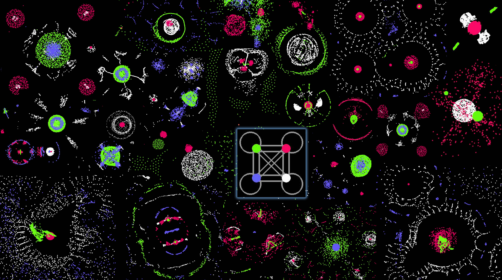

# Particle Life Simulation
A simple program to simulate attraction/reuplsion forces between many particles

Learn More Here (video tutorial):
-----------------------------------------------
video tutorial comming soon

Interface
--------------------------------------------------------

Example Results
--------------------------------------------------------

Code
----------------
Source code available in both C++ (using openframeworks liberary) and javascript

The java script code is as simple as this:

<canvas id="life" width="500" height="500"></canvas>

 
