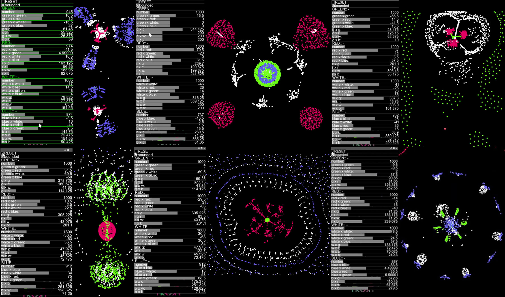

# Particle Life Simulation
A simple program to simulate attraction/reuplsion forces between many particles, producing life like patterns as a result. The code is less than a page (excluding GUI elements). Video tutorial and Walkthrough is availble below.

Learn More Here (YouTube video tutorial):
-----------------------------------------------
https://youtu.be/0Kx4Y9TVMGg


Interface
--------------------------------------------------------


Example Results
--------------------------------------------------------


Some Interesting Patterns to Reproduce:
-------------------------------------
You don't need to be exact with the parameters to reproduce these patterns. The best way to get interesting patterns: First try random paramter explorations, once you find an intersting pattern then try to slowly fine-tune it. To avoid being stuck at a local maximum, you can make some occasional big parameter jumps. This way interesting & different patterns keep poping up.



Code
----------------
Source code available in both C++ and javascript


If you like to contribute to the C++ program. The core algorthim is the first 100 lines of code at:  "/particle_life/src/ofApp.cpp". Everything else are GUI components & rendering controls which are provided by the openFrameworks library.  openFrameworks is an opensource, nice, and easy to use image rendering library https://openframeworks.cc/

Todos (If I have time):
--------------------
1. Adding the ability to save and load parameters (so that people can easily share the intersting models they find)
2. Ability to add more particle types (currently it's fixed to four particle types)
3. Currently, the biggest bottle neck is the nested for-loops (which calculates the pairwise distance among all particles) making the computional complexity quadratic. It will be amazing if we could find a way around this bottle neck.
4. Alternative to point 4, computing the pairwise distances are embarsingly parallel so it can be computed on GPU.
5. Adding a more intutive UI so that it gives the ability for a finer control over the paramters + adding a randomize button.
6. A better way to fine-tune is to use an evolutionary algorthim to select and optimize the parameters but one needs to write a fitness function for that. I currently don't know what fitness function corrsponds to in the realm of this program.


The javascript code is as simple as this ( watch this YouTube video for a walkthrough tutorial: https://youtu.be/0Kx4Y9TVMGg )
```
  <canvas id="life" width="500" height="500"></canvas>
  <script>
    //Hunar Ahmad @ brainxyz
  m=document.getElementById("life").getContext('2d')
  draw=(x,y,c,s)=>{m.fillStyle=c; m.fillRect(x, y, s, s)}
  atoms=[]
  atom=(x,y,c)=>{return{"x":x, "y":y, "vx":0, "vy":0, "color":c}}
  random=()=>{return Math.random()*400+50}
  create=(number, color)=>{ 
  	group=[]
    for(let i=0; i < number; i++){
	    group.push(atom(random(), random(), color))
	    atoms.push(group[i]) 
	}
    return group 
  }
  rule=(atoms1, atoms2, g)=>{
  for(let i=0; i < atoms1.length; i++){
    fx = 0
    fy = 0
    for(let j=0; j < atoms2.length; j++){
      a = atoms1[i]
      b = atoms2[j]
      dx = a.x-b.x
      dy = a.y-b.y
      d = Math.sqrt(dx*dx + dy*dy)
      if(d > 0 && d < 80){
      	F = g * 1/d
        fx += (F * dx)
        fy += (F * dy)
      }
    } 
    a.vx = (a.vx + fx)*0.5
    a.vy = (a.vy + fy)*0.5
    a.x += a.vx
    a.y += a.vy
    if(a.x <= 0 || a.x >= 500){ a.vx *=-1 }
    if(a.y <= 0 || a.y >= 500){ a.vy *=-1 }
    }
  }
  yellow = create(200, "yellow")
  red = create(200, "red")
  green = create(200, "green")
  update=()=>{
    rule(green, green, -0.32)
    rule(green, red, -0.17)
    rule(green, yellow, 0.34)
    rule(red, red, -0.10)
    rule(red, green, -0.34)
    rule(yellow, yellow, 0.15)
    rule(yellow, green, -0.20)
    m.clearRect(0, 0, 500, 500)
    draw(0, 0, "black", 500)
    for(i=0; i<atoms.length; i++){ 
    draw(atoms[i].x, atoms[i].y, atoms[i].color, 5) 
    }
    requestAnimationFrame(update)
  }
  update();
  </script>

```

</br>


Related topics:
#artificial 
Particle Life Simulation
Primordial Soup - Evolution
Conway's game of life
Cellular automata
JavaScript programming

This project was inspired by: Jeffery Ventrella's Clusters http://www.ventrella.com/Clusters/
I don't have access to Ventrella's code but I guess the main difference of this project with the other particle life projects is that I didn't implement collision detection as this allows simulating thousands of particles easily. Also, I added GUI controls to change the parameters in realtime this allows easy fine-tuning & exploration. Also, the code here is probably an order of magnitude simpler than any other Artificial Life codes out there because I started this code solely as an eductaional material for non-programers and general audience to prove the point that complexity can arise from simplicity.
